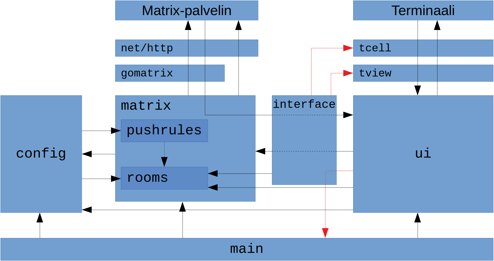
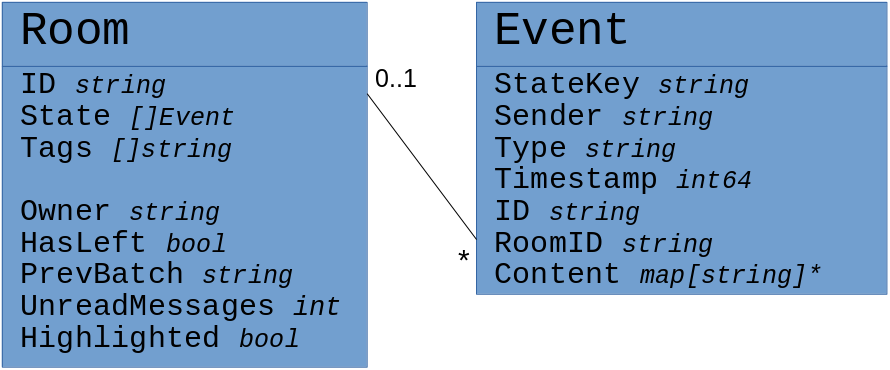

### Pakkauskaavio
Punaisella merkityt yhteydet on tarkoitus poistaa, jotta käyttöliittymäpaketin voisi korvata eri käyttöliittymällä mahdollisimman helposti.

### Luokkakaavio

### Viestin lähetyksen sekvenssikaavio

