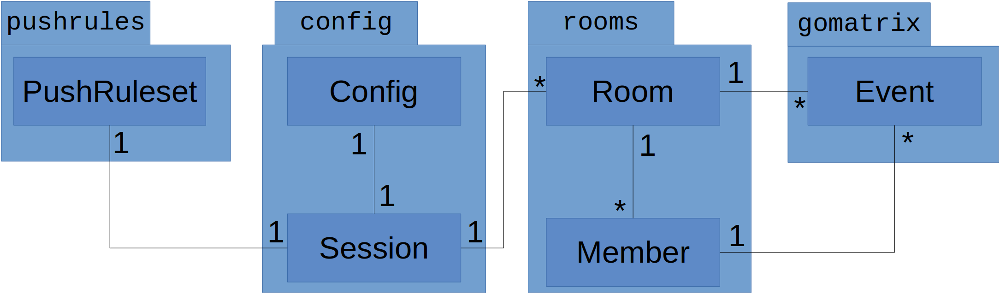

# Arkkitehtuurikuvaus

## Rakenne
Ohjelmassa on kolme tärkeää pakettia: `matrix`, `ui` ja `config`:
* `matrix` hoitaa kommunikaation Matrix-paketin kanssa ja siihen liittyvän logiikan.
* `ui` hoitaa kaiken käyttöliittymään liittyvän.
* `config` hoitaa `matrix`-paketin vaatiman tiedon paikallisen tallennuksen (esim. tunnistustiedot).

Ohjelma sisältää myös muita vähemmän merkittäviä paketteja:
* `debug`     - debug-logien kirjoitus ja korjaamattomien virheiden näyttö
* `interface` - rajapintatyyppejä, joiden avulla paketit voivat käyttää toisiaan ilman, että toisen paketin nimi
                pitää kovakoodata importtina.
* `lib`       - kirjastotyyppisiä paketteja, joita ei ole saatavilla ulkoisina kirjastoina.

### Pakkauskaavio
Punaisella merkityt yhteydet on tarkoitus poistaa, jotta käyttöliittymäpaketin voisi korvata eri käyttöliittymällä
mahdollisimman helposti.

## Sovelluslogiikka
Tärkein tyyppi sovelluksessa on tapahtuma (`Event`-luokka).

Huoneiden tila (`State`) on lista tietyntyyppisiä huonekohtaisia tapahtumia ja tagit haetaan käyttäjäkohtaisesta
`m.tag`-tyyppisestä tapahtumasta

Matrix-palvelimen kanssa kommunikointi tapahtuu `matrix`-paketin `Container`-tyypin funktioiden avulla.
Näitä ovat esimerkiksi:
* `SendMessage(roomID, msgtype, text string) (string, error)`
* `JoinRoom(roomID string) (*rooms.Room, error)`
* `GetHistory(roomID, prevBatch string, limit int) ([]Event, string, error)`

Lisäksi `Container`-tyyppi sisältää tulevien tapahtumien käsittelyfunktioita, esimerkiksi `HandleMessage` joka
käsittelee tulevat `m.room.message`-tyyppiset tapahtumat ja lähettää ne käyttöliittymälle.

## Tietojen pysyväistallennus
Lähes kaikki palvelimelle tallennettu tieto on jossain vaiheessa tapahtumamuodossa. Useimmat tapahtumat tapahtuvat
tietyssä huoneessa, mutta esimerkiksi käyttäjäkohtaiset asetukset tallennetaan ei-huonekohtaisina tapahtumina.

Tapahtumien lisäksi huoneet sisältävät käyttäjiä. Käyttäjäluokkia ei kuitenkaan tallenneta sellaisenaan, vaan niiden
tiedot lasketaan huoneiden tilatapahtumista.

Aiemmin mainittu `Container`-tyyppi hoitaa viestien lähettämisen palvelimelle, mutta osa tiedoista tallennetaan
paikallisesti: `config`-paketin `Config`- ja `Session`-tyypit hoitavat esimerkiksi käyttäjän tunnistautumiseen
vaadittavien tietojen tallennuksen paikallisesti. Koska huoneissa on käyttäjäkohtaisia tietoja (esim tagit), niihin
liittyy aina joku `Session`-olio.

Lisäksi `Session`-olioon on liitettynä `PushRules`-olio, joka sisältää käyttäjäkohtaiset ohjeet työpöytänotifikaatioiden
lähettämiseen. `PushRules`-olio haetaan ja tallennetaan `Container`in avulla Matrix-palvelimelta/lle.

### Tiedostot
`Config`-olion sisältämät tiedostot tallennetaan kansioon `~/.config/gomuks/config.yaml`. `Session`-oliot tallennetaan
samaan kansioon ja tiedostonimenä käytetään käyttäjän Matrix ID:tä, esimerkiksi `~/.config/gomuks/@tulir:maunium.net.session`.
Konfiguraatio- ja session-tiedostot ovat YAML-formaatissa.

## Päätoiminnallisuudet
### Viestin lähetys
Kun Matrix-palvelin lähettää uuden tapahtuman etenee sovelluksen kontrolli seuraavasti:

