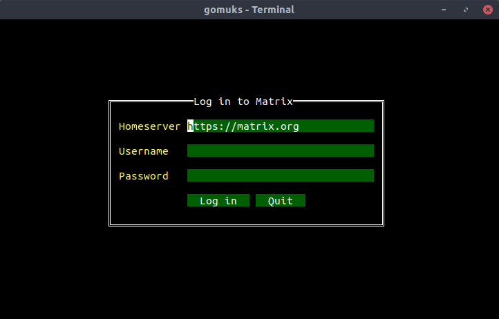

# Käyttöohje
Asenna gomuks kääntämällä se [README](../README.md)ssa selitetyllä tavalla tai
lataamalla valmiiksi käännetty versio [releases](https://github.com/tulir/hy-otm/releases)-osiosta.

## Ohjelman käynnistäminen
Ohjelma käynnistetään ajamalla
```bash
$ ./gomuks
```

Jos ohjelma on `$PATH`:ssa (esim Debian-paketilla asennettuna), komento on
```bash
$ gomuks
```

## Kirjautuminen
Sovellus käynnistyy kirjautumisnäkymään:


Sovellus käyttää tällä hetkellä pääasiassa näppäimistöä ohjaamiseen: Kenttien
välillä voi siirtyä Tab-näppäimellä eteenpäin ja Shift+Tab-näppäinyhdistelmällä
taaksepäin. Enter-näppäin siirtyy seuraavaan kenttään tai painaa valittua nappia.

Rekisteröityminen ei tällä hetkellä ole mahdollista.
Luo tili osoitteessa [riot.im/app](https://riot.im/app/).

Halutessasi voit rekisteröityä eri palvelimelle. Tässä tapauksessa `Homeserver`
kenttään on asetettava palvelimen asiakasohjelmia palvelevan API:n osoite.
Lista palvelimista löytyy [täältä](https://www.hello-matrix.net/public_servers.php).

## Keskustelunäkymä


Viestihistoriaa voi ladata rullaamalla näkymää hiirellä tai käyttämällä page
up/down -näppäimiä.

### Huoneet
Huoneiden välillä siirtyminen tapahtuu ctrl+ylös/alas tai alt+ylös/alas
-näppäinkomennoilla, tai painamalla hiirellä huoneen nimeä listassa.

Huoneiden luonti ei tällä hetkellä ole mahdollista.
Olemassaoleviin huoneisiin voi liittyä komennolla `/join <huone>`, jossa
`<huone>` on huoneen ID tai osoite (esimerkiksi `#test:maunium.net`)
